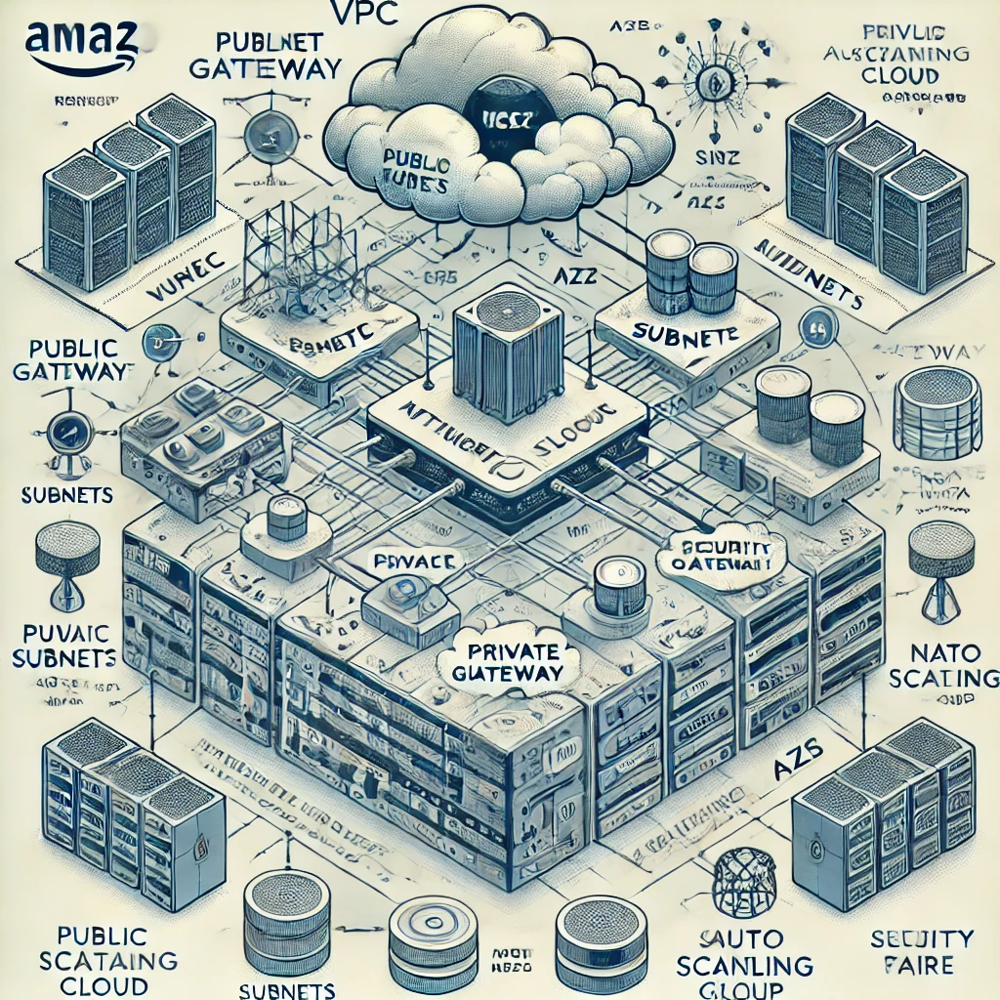

# Network Stack on AWS

This project provides a Terraform configuration to set up a robust and flexible network stack on AWS. It leverages the Terraform AWS modules to create and manage a Virtual Private Cloud (VPC), Security Groups, Auto Scaling Groups (ASGs), and associated resources such as subnets, route tables, and NAT gateways. This setup is designed to be highly customizable, allowing for efficient scaling and management of resources within the AWS ecosystem.

## Table of Contents

- [Overview](#overview)
- [Architecture](#architecture)
- [Features](#features)
- [Prerequisites](#prerequisites)
- [Usage](#usage)
- [Modules](#modules)
- [Variables](#variables)
- [Outputs](#outputs)
- [Contributing](#contributing)
- [License](#license)

## Overview

This Terraform project automates the deployment of a network stack on AWS using infrastructure as code (IaC). The configuration deploys a VPC with public and private subnets, internet gateways, NAT gateways, security groups, and an Auto Scaling Group (ASG) for scalable compute resources. This setup is ideal for environments that require a flexible, secure, and highly available infrastructure.

## Architecture

The network architecture includes:

- A VPC with a customizable CIDR block.
- Public and private subnets spread across multiple Availability Zones (AZs).
- Internet Gateway for outbound internet access for public subnets.
- NAT Gateway for secure internet access from private subnets.
- Security Groups for controlling inbound and outbound traffic.
- An Auto Scaling Group for scaling EC2 instances automatically based on demand.

## Features

- **Highly Configurable**: Easily customize the CIDR range, number of subnets, instance types, and other parameters.
- **Scalable Infrastructure**: Automatically scales EC2 instances in response to demand.
- **Secure Networking**: Implements Security Groups with customizable ingress and egress rules.
- **Modular Design**: Uses Terraform AWS modules for VPC, ASG, and Security Group management.
- **User Data Script**: Installs Nginx on EC2 instances upon launch, providing a simple web server setup.

## Prerequisites

Before you begin, ensure you have the following:

- **Terraform** installed on your local machine (version 1.0+).
- **AWS CLI** configured with the necessary access and secret keys.
- An **AWS Account** with appropriate permissions to create and manage resources.
- An **SSH Key Pair** to access EC2 instances.

## Usage

1. **Initialize Terraform**:
    ```bash
    terraform init
2. **Customize Variables**

Update the variables.tf file or create a terraform.tfvars file to customize the variable values as needed.

3. **Plan the Infrastructure**
    ```bash
    terraform plan
4. **Apply the Configurations**
    ```bash
    terraform apply
Confirm the apply step with yes when prompted.

5. **Destroy the Infrastructure**
    ```bash
    terraform destroy

## Modules

This project utilizes the following Terraform modules:

**VPC Module:** Creates and manages a VPC, subnets, route tables, and NAT gateways.

**Security Group Module:** Manages EC2 security groups with customizable ingress and egress rules.

**Auto Scaling Group Module:** Creates an Auto Scaling Group with the specified instance type and capacity settings.

## Variables

Key variables used in this project:
| Variable                    | Description                                                                                           | Default Value                 |
|-----------------------------|-------------------------------------------------------------------------------------------------------|-------------------------------|
| `aws_region`                | The AWS region where the infrastructure will be deployed. Example: ap-southeast-1 (Singapore)          | `ap-southeast-1`              |
| `username`                  | The username of the individual applying the Terraform code, used for resource tagging or tracking changes. | `""`                          |
| **VPC VARIABLES**           |                                                                                                       |                               |
| `vpc_cidr`                  | The CIDR block for the Virtual Private Cloud (VPC). Defines the range of IP addresses for the VPC.     | `""`                          |
| `availability_zones`        | The list of Availability Zones within the region where the VPC resources (such as subnets) will be deployed. | `["ap-southeast-1a"]`         |
| `vpc_private_subnets`       | A list of CIDR blocks for private subnets within the VPC, typically used for internal resources not exposed to the internet. | `[]`                          |
| `vpc_public_subnets`        | A list of CIDR blocks for public subnets within the VPC, typically used for resources that need direct internet access. | `[]`                          |
| `enable_dns_hostnames`      | A boolean flag to enable or disable DNS hostnames in the VPC. Required for instances that need DNS resolution. | `false`                       |
| `enable_dns_support`        | A boolean flag to enable or disable DNS support in the VPC. When enabled, the instances can resolve AWS service endpoints. | `false`                       |
| `enable_nat_gateway`        | A boolean flag to enable or disable a NAT gateway in the VPC, which allows instances in private subnets to access the internet. | `false`                       |
| `single_nat_gateway`        | A boolean flag to specify if a single NAT gateway should be created for the entire VPC. Helps in reducing costs. | `false`                       |
| **ASG VARIABLES**           |                                                                                                       |                               |
| `instance_type`             | The type of EC2 instance (e.g., t2.micro, t3.medium) to be deployed by the Auto Scaling Group.         | `""`                          |
| `min_size_asg`              | The minimum number of EC2 instances that should be maintained by the Auto Scaling Group.               | `0`                           |
| `max_size_asg`              | The maximum number of EC2 instances that can be launched by the Auto Scaling Group.                    | `0`                           |
| `desired_capacity_asg`      | The desired number of EC2 instances that should be running in the Auto Scaling Group.                  | `0`                           |
| `wait_for_capacity_timeout` | The maximum time (in seconds) to wait for the Auto Scaling Group to reach the desired capacity.        | `0`                           |
| `health_check_type`         | The type of health checks (e.g., EC2, ELB) to perform on instances in the Auto Scaling Group.          | `""`                          |
| **SG VARIABLES**            |                                                                                                       |                               |
| `sg_description`            | A description or purpose of the Security Group associated with EC2 instances.                          | `""`                          |
| `sg_ingress_cidr_block`     | A list of CIDR blocks allowed for ingress traffic. Defines the allowed source IPs for inbound traffic. | `["0.0.0.0/0"]`               |
| `sg_ingress_rules`          | A list of ingress rules defining the allowed protocols, ports, and sources for inbound traffic.        | `["http-80-tcp"]`             |
| `sg_egress_cidr_block`      | A list of CIDR blocks allowed for egress traffic. Defines the allowed destination IPs for outbound traffic. | `["0.0.0.0/0"]`               |
| `sg_egress_rules`           | A list of egress rules defining the allowed protocols, ports, and destinations for outbound traffic.   | `["all-all"]`                 |

## Outputs
The following outputs are provided by the Terraform configuration:

**name:** The name of the network stack.

**aws_account_id:** The AWS account ID where the stack is deployed.

**vpc_id:** The ID of the created VPC.

**public_subnets:** List of public subnet IDs.

**private_subnets:** List of private subnet IDs.

**ec2_security_group_name:** The name of the EC2 Security Group.

**autoscaling_group_id:** The ID of the Auto Scaling Group.

**launch_configuration_id:** The ID of the launch configuration.

**private_key_pem:** The SSH private key for accessing EC2 instances (sensitive).

## Contributing
Contributions are welcome! Please submit a pull request or open an issue to suggest improvements or report bugs.
